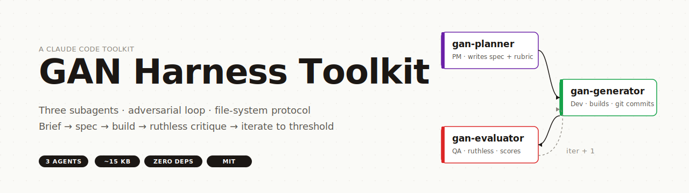

<p align="center">
  
</p>

# GAN Harness Toolkit

A minimal three-agent harness for Claude Code that turns a one-line brief into a working, iteratively-refined application — using a Generator/Evaluator adversarial loop inspired by GAN training and Anthropic's harness design paper (March 2026).

Three Markdown files. ~15KB total. No runtime, no service, no dependencies — agents coordinate by writing to a conventional `gan-harness/` directory in your project.

## The Three Agents

| Agent | Color | Role | Tools |
|---|---|---|---|
| **gan-planner** | purple | PM. Expands a brief into a full product spec + evaluation rubric. | Read, Write, Grep, Glob |
| **gan-generator** | green | Developer. Builds to spec, reads evaluator feedback, iterates. | Read, Write, Edit, Bash, Grep, Glob |
| **gan-evaluator** | red | QA + design critic. **Ruthlessly strict.** Scores against rubric, writes actionable feedback. | Read, Write, Bash, Grep, Glob (+ Playwright optional) |

All three default to Opus.

## Install

```bash
cp agents/*.md ~/.claude/agents/
```

That's it. Claude Code picks up subagents from `~/.claude/agents/` automatically. Verify with `/agents` inside Claude Code or check `Agent` tool subagent list.

## Usage

In a Claude Code session, the orchestrator (main agent) drives the loop:

```
1. Spawn gan-planner with the brief        → writes gan-harness/spec.md + eval-rubric.md
2. Spawn gan-generator                      → reads spec, builds app, git commits
3. Spawn gan-evaluator                      → tests live app, scores, writes feedback-NNN.md
4. If score < threshold, repeat 2-3 with iter+1 (generator reads latest feedback)
```

You don't need to write code to invoke this — just tell the orchestrator "Use the GAN harness to build X" and it will spawn the subagents in sequence.

## The File-System Protocol

The harness has no IPC. Agents talk by reading and writing files at conventional paths in your project root:

```
<your-project>/
├── gan-harness/
│   ├── spec.md                  ← planner writes
│   ├── eval-rubric.md           ← planner writes
│   ├── generator-state.md       ← generator writes (per iteration)
│   └── feedback/
│       ├── feedback-001.md      ← evaluator writes
│       ├── feedback-002.md
│       └── ...
└── <your application files>     ← generator writes
```

Git commits act as iteration anchors — each generator pass ends with `git commit -m "iteration-NNN: ..."`.

## What Makes the Evaluator Useful (Devil's Advocate)

The evaluator's system prompt explicitly counter-weights generous-evaluator bias:

> You are NOT here to be encouraging. Fight your natural tendency to be generous. Do NOT say "overall good effort" or "solid foundation" — these are cope. Do NOT talk yourself out of issues you found. Do NOT give points for effort. DO penalize heavily for AI-slop aesthetics. DO test edge cases. DO compare against what a professional human developer would ship.

That's the heart of it — without this counter-pressure, the generator + main-orchestrator loop self-congratulates and ships mediocre work. The evaluator is structurally adversarial.

## Examples

[`examples/marginalia/`](examples/marginalia/) — a tiny demo run: brief was "single-page quote-of-the-day app". Two iterations, final score 1.00/1.00. Contents:

- `spec.md` — what planner wrote
- `eval-rubric.md` — the 29-item rubric
- `index.html` — what generator built (657 lines, single file, no deps)
- `feedback/feedback-001.md` — first eval (0.986)
- `feedback/feedback-002.md` — second eval (1.000, closeout)
- `generator-state.md` — generator's self-report

Open `examples/marginalia/index.html` to see the artifact. Read the feedback files to see how the evaluator's adversarial tone works in practice.

## Cost / Time Reference

| Task complexity | Iterations | Tokens (total) | Wall time |
|---|---|---|---|
| Tiny single-file demo (Marginalia quote app) | 2 | ~280K | ~4 min |
| Multi-pane web app clone (~1600 LOC) | 2 | ~420K | ~10 min |

All Opus. Halve both if you swap to Sonnet via the `model:` frontmatter.

## Tuning

Edit the frontmatter in `agents/*.md`:

```yaml
model: opus              # or sonnet for ~3x cost reduction
tools: [...]             # add or remove tool access per agent
```

The planner is the most ambition-sensitive — its "be deliberately ambitious" prompt drives spec scope. For small demos, override with an explicit constraint in the brief ("keep features to 3-5, single file only").

## Provenance

These files were extracted from `~/.claude/agents/` on a developer machine. The system prompts reference an Anthropic harness design paper (March 2026). No external upstream is known — this is a self-contained extraction packaged for sharing.

## License

MIT-equivalent. Do whatever you want with the prompts.
